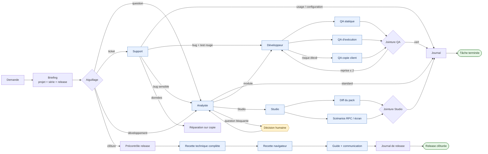

# Agents Odoo — Claude Code & Codex

Un même dispositif pour traiter les demandes Odoo avec Claude Code ou Codex :
des rôles spécialisés, un graphe persistant, des preuves vérifiables et une
mémoire de projet commune. La série Odoo est toujours détectée avant le travail
(17.0, 18.0, 19.0 ou saas~19.x).

Pour installer ou mettre à jour le dispositif, voir [INSTALL.md](INSTALL.md).

## Ce que fait le dispositif

- il aiguille une demande vers l'analyse, le support, le développement, Studio,
  la QA, la documentation ou la clôture de release ;
- il parallélise uniquement les recherches et contrôles indépendants ;
- il garde un seul écrivain par module, base et livrable partagé ;
- il conserve la position du travail dans
  `<projet>/.odoo-agents/flows/` ;
- il exige une preuve pour franchir un nœud et borne les reprises à deux ;
- il rend visibles dans le terminal le rôle actif, les agents mobilisés, les
  prochaines étapes et les attentes humaines.

## Vue d'ensemble



Ce schéma montre le parcours métier. Le graphe exécutable complet contient les
portes, reprises, journaux et terminaux :

```bash
python3 ~/.odoo19-agents/scripts/odoo_flow.py render --format mermaid
```

## Ce que l'on voit dans le terminal

`odoo_flow.py ready` affiche la position et les prochaines étapes ; `status`
ajoute l'historique récent. Les sorties JSON restent disponibles avec
`--json` pour l'automatisation. Le bloc `running_nodes` y expose aussi le rôle,
le propriétaire, l'heure de revendication et les verrous de chaque nœud actif.

```text
ODOO FLOW · ajout-reference
────────────────────────────────────────────────────────────────────────
État       PRÊT
Flux       development
Projet     /srv/odoo/client
Progression 3 étape(s) franchie(s)
Agents délégués 0 actif(s) · 2 prêt(s)
Dernière   ✓ module_implementation → done

POSITION DANS LE GRAPHE
  VAGUE 1 · PARALLÈLE · 2 nœuds
  ○ module_runtime_qa
    AGENT · odoo-tester · graph-lane-runtime
    Voie QA normale : installer, mettre à jour et exécuter les tests ciblés.
    Sorties: done · Preuve: fragment QA d'exécution
  ○ module_static_qa
    AGENT · odoo-tester · graph-lane-static
    Voie QA normale : relire le diff et exécuter le lint ciblé.
    Sorties: done · Preuve: fragment QA statique
```

Légende :

| Marqueur | Signification |
|---|---|
| `▶` | nœud revendiqué et en cours |
| `○` | nœud prêt pour l'orchestrateur ou un agent |
| `◆` | décision humaine attendue |
| `✓` | transition enregistrée avec sa preuve |
| `VAGUE … PARALLÈLE` | nœuds compatibles pouvant être délégués simultanément |

L'orchestrateur affiche `status` avant une vague, utilise un propriétaire
explicite lors de `claim`, puis laisse `complete` afficher la nouvelle position.
Les agents spécialisés ne modifient jamais eux-mêmes l'état du graphe.

## Le premier réflexe : le briefing

Avant toute lecture ou écriture de code Odoo :

```bash
python3 ~/.odoo19-agents/scripts/odoo_briefing.py <module_ou_projet>
```

Le briefing donne en une seule sortie :

- la série et l'origine de sa détection ;
- la release ouverte et ses points ;
- la compréhension métier, les décisions et les pièges connus ;
- les dernières entrées du journal et les leçons applicables ;
- les formes de code attendues dans cette série ;
- les sauvegardes, mails et bases de test disponibles.

Si `.odoo-agents/` manque, initialiser d'abord le projet :

```bash
~/.odoo19-agents/scripts/odoo_project_scan.py <racine_du_projet>
```

## Choisir le bon point d'entrée

| Nature de la demande | Point d'entrée | Résultat attendu |
|---|---|---|
| Comprendre, cadrer, arbitrer | `odoo-analyst` | revue fonctionnelle, aucun code |
| Ticket ou dysfonctionnement | `odoo-support` | cause prouvée, classement, contournement, suite |
| Développer ou configurer | `/odoo-new <demande>` | analyse → module ou Studio → QA → journal |
| Clôturer et livrer | `/odoo-close` | recette complète → captures → guide → communication |
| Valider seulement | `odoo-tester` | verdict de QA de release |
| Déclarer un environnement | `/odoo-env` | métadonnées projet + secret dans le trousseau |
| Documenter explicitement | `camptocamp-docs` | DOCX, PDF, captures ou communication client |
| Capitaliser un retour | `/odoo-feedback` | journal, leçons et règles du dispositif |

Les mêmes noms sont disponibles dans Claude Code et Codex. Si les sous-agents
ne sont pas disponibles, l'agent principal applique lui-même le rôle : les
preuves et les transitions restent identiques.

## Comment le graphe est piloté

```bash
FLOW=$(python3 ~/.odoo19-agents/scripts/odoo_flow.py start <projet> \
  --kind development --id ajout-reference)

python3 ~/.odoo19-agents/scripts/odoo_flow.py status "$FLOW"
python3 ~/.odoo19-agents/scripts/odoo_flow.py claim "$FLOW" briefing \
  --owner orchestrateur
python3 ~/.odoo19-agents/scripts/odoo_flow.py complete "$FLOW" briefing \
  --owner orchestrateur --outcome development --evidence <preuve>
```

Principes :

1. `ready` ou `status` désigne les seuls nœuds exécutables.
2. `claim` réserve le nœud et ses ressources avant le travail.
3. Chaque voie parallèle écrit un fragment distinct dans
   `.odoo-agents/flow-artifacts/<run>/`.
4. L'orchestrateur fusionne les fragments dans les fichiers de release.
5. `complete` exige une preuve existante et enregistre la transition.
6. Une porte humaine exige en plus `--human-confirmed`.
7. Une reprise après modification compatible du graphe exige `migrate` ; elle
   n'est jamais silencieuse.

Le registre empêche les collisions entre runs d'un même projet. Il protège le
code, les bases, les packs Studio, le navigateur et les documents partagés.

## Tâche légère, release lourde

```text
release ouverte
    ├── /odoo-new demande A ── analyse ── réalisation ── QA ciblée ── journal
    ├── /odoo-new demande B ── analyse ── réalisation ── QA ciblée ── journal
    └── /odoo-close ────────── recette complète ── livrables ── clôture
```

- Pendant une release ouverte, chaque tâche reçoit le lint des fichiers
  touchés, une installation ou mise à jour et les tests ciblés.
- Les droits, la comptabilité, la facturation et les données existantes
  déclenchent immédiatement la QA renforcée sur la copie client.
- La clôture rejoue une seule fois la recette complète : base neuve, suite
  entière, tours, désinstallation et mise à niveau sur la copie client.
- Les captures, le guide et la communication client attendent la clôture, sauf
  demande humaine explicite.
- La version du manifest s'incrémente une fois par release, sur l'état testé.

## État et livrables d'un projet

| Emplacement | Rôle | Écrivain |
|---|---|---|
| `.odoo-agents/config` | série et vocabulaire du projet | scan, puis humain |
| `.odoo-agents/PROJECT.md` | relevé et compréhension métier durable | scan et agents |
| `.odoo-agents/JOURNAL.md` | mémoire courte, une entrée par intervention | orchestrateur |
| `.odoo-agents/flows/` | état local reprenable des runs | moteur du graphe |
| `.odoo-agents/flow-artifacts/` | preuves isolées des voies parallèles | agents spécialisés |
| `changelog/<release>/` | demande, revue, QA, recette et livrables | orchestrateur |
| `inbox/` | sauvegardes et mails confiés aux agents | humain |

Les fichiers de release sont le canal de transmission entre les rôles. La
conversation n'est ni l'état du workflow ni le stockage des décisions.

## Commandes utiles

```bash
# État du graphe
python3 ~/.odoo19-agents/scripts/odoo_flow.py ready "$FLOW"
python3 ~/.odoo19-agents/scripts/odoo_flow.py status "$FLOW"
python3 ~/.odoo19-agents/scripts/odoo_flow.py status "$FLOW" --json

# Release
~/.odoo19-agents/scripts/odoo-release.sh open <projet> "Résultat métier"
~/.odoo19-agents/scripts/odoo-release.sh current <projet>
~/.odoo19-agents/scripts/odoo-release.sh add <release> "Point à livrer"

# Contrôles d'une tâche puis d'une release
~/.odoo19-agents/scripts/odoo-lint.sh --changed <référence> <module>
~/.odoo19-agents/scripts/odoo-test.sh <module> --quick --tags /<module>:<classe>
~/.odoo19-agents/scripts/odoo-recette.sh <module> --release <release> --db <copie>

# Copie client et inventaire
~/.odoo19-agents/scripts/odoo-restore.sh <sauvegarde.zip> --db <client>_test
~/.odoo19-agents/scripts/odoo-config-inventory.sh <client>_test
```

Chaque script documente ses options avec `--help`. Les accès distants se
déclarent avec `/odoo-env` ; aucun secret ne doit apparaître dans la
conversation, les fichiers ou les journaux.

## Architecture du référentiel

```text
~/.odoo19-agents/
├── README.md                    fonctionnement et utilisation
├── INSTALL.md                   installation et mise à jour
├── AGENTS.md                    règles de maintenance du dispositif
├── routing.md                   aiguillage injecté dans Claude et Codex
├── ODOO19_STYLE_GUIDE.md        ligne éditoriale 19.0
├── SERIES_MATRIX.md             différences entre séries, fait foi
├── PLATEFORMES.md               différences d'hébergement
├── LESSONS.md                   mémoire longue
├── workflows/
│   └── odoo-workflow.json       graphe exécutable
├── roles/                       sources uniques des profils
├── scripts/
│   ├── odoo_flow.py             moteur et tableau de bord du graphe
│   ├── odoo_briefing.py         contexte initial compact
│   └── …                        release, QA, Studio, instances, captures
├── tests/
│   └── test_odoo_flow.py        structure et parcours du graphe
├── docs/                        modèles et charte documentaire
├── stack/                       environnement Odoo local de QA
└── build.sh                     validation et génération des profils
```

Les profils sous `~/.claude/` et `~/.codex/` sont générés : ils ne s'éditent
jamais directement. Toute évolution part de ce référentiel puis passe par
`./build.sh`.

## Garanties et limites

- Les cycles sont bornés et tout nœud peut atteindre un terminal.
- Un changement sensible ne peut pas retomber dans la QA module normale.
- Une clôture rouge ne produit pas les documents de livraison.
- Une écriture en production reste protégée par `odoo_instance.py`, en plus de
  la porte humaine du graphe.
- Les verrous sont locaux au projet et à la machine ; ils ne constituent pas
  un verrou distribué entre plusieurs postes.
- La preuve est actuellement contrôlée par existence de fichier ; sa qualité
  est évaluée par le rôle et l'orchestrateur.

Le détail de l'installation, de la validation et de la mise à jour se trouve
dans [INSTALL.md](INSTALL.md).
