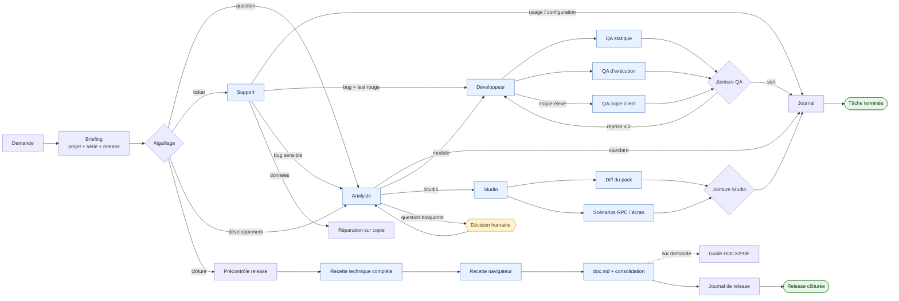

# Guide technique — agents Odoo

Un même dispositif pour traiter les demandes Odoo avec Claude Code ou Codex :
des rôles spécialisés, un plan de release, un graphe persistant, des preuves
vérifiables et une mémoire de projet commune. La série Odoo est toujours détectée avant le travail
(17.0, 18.0, 19.0 ou saas~19.x).

Pour installer ou mettre à jour le dispositif, voir [INSTALL.md](INSTALL.md).

Pour améliorer le dispositif, `/odoo-improve` pilote la boucle **essai → défaut
observé → correction → contre-épreuve → adoption dans les profils**. Le
[espace qualité et amélioration](quality-lab/README.md) distingue réponses sur dossier,
parcours natifs avec outils et oracles Odoo. Les
[propositions suivies](../docs/IMPROVEMENTS.md) relient chaque changement à sa preuve
et à ses limites.
Les profils peuvent être générés à part avec `./build.sh --output-root /tmp/odoo-dist`,
puis vérifiés sans modification avec `./build.sh --output-root /tmp/odoo-dist --check`.

[Retour à la présentation](../README.md)

## Ce que fait le dispositif

- il aiguille une demande vers l'analyse, le support, le développement, Studio,
  la QA, la documentation ou la clôture de release ;
- il parallélise uniquement les recherches et contrôles indépendants ;
- il garde un seul écrivain par module, base et livrable partagé ;
- il conserve la position du travail dans
  `<projet>/.odoo-agents/flows/` ;
- il exige une preuve pour franchir un nœud et borne les reprises à deux ;
- il rend visibles dans le terminal le rôle actif, les agents mobilisés, les
  prochaines étapes et les attentes humaines.

## Vue d'ensemble



Ce schéma montre le parcours métier. Le graphe exécutable complet contient les
portes, reprises, journaux et terminaux :

```bash
python3 ~/.odoo19-agents/scripts/odoo_flow.py render --format mermaid
```

## Ce que l'on voit dans le terminal

`odoo_flow.py ready` affiche la position et les prochaines étapes ; `status`
ajoute l'historique récent. Les sorties JSON restent disponibles avec
`--json` pour l'automatisation. Le bloc `running_nodes` y expose aussi le rôle,
le propriétaire, l'heure de revendication et les verrous de chaque nœud actif.

```text
ODOO FLOW · ajout-reference
────────────────────────────────────────────────────────────────────────
État       PRÊT
Flux       development
Projet     /srv/odoo/client
Progression 3 étape(s) franchie(s)
Nœuds agent 0 revendiqué(s) · 2 prêt(s)
Dernière   ✓ module_implementation → done

POSITION DANS LE GRAPHE
  VAGUE 1 · PARALLÈLE · 2 nœuds
  ○ module_runtime_qa
    AGENT · odoo-tester · graph-lane-runtime
    Voie QA normale : installer, mettre à jour et exécuter les tests ciblés.
    Sorties: done · Preuve: fragment QA d'exécution
  ○ module_static_qa
    AGENT · odoo-tester · graph-lane-static
    Voie QA normale : relire le diff et exécuter le lint ciblé.
    Sorties: done · Preuve: fragment QA statique
```

Une revendication réserve le travail et ses verrous ; elle ne prouve pas qu'un
sous-agent a démarré. Les identifiants et événements du moteur de sous-agents
font foi pour mesurer la délégation effective. Un rôle exécuté par
l'orchestrateur lui-même reste également un nœud revendiqué.

Légende :

| Marqueur | Signification |
|---|---|
| `▶` | nœud revendiqué et en cours |
| `○` | nœud prêt pour l'orchestrateur ou un agent |
| `◆` | décision humaine attendue |
| `✓` | transition enregistrée avec sa preuve |
| `VAGUE … PARALLÈLE` | nœuds compatibles pouvant être délégués simultanément |

L'orchestrateur affiche `status` avant une vague, utilise un propriétaire
explicite lors de `claim`, puis laisse `complete` afficher la nouvelle position.
Les agents spécialisés ne modifient jamais eux-mêmes l'état du graphe.

## Le premier réflexe : le briefing

Avant toute lecture ou écriture de code Odoo :

```bash
python3 ~/.odoo19-agents/scripts/odoo_briefing.py <module_ou_projet>
```

Le briefing donne en une seule sortie :

- la série et l'origine de sa détection ;
- la release ouverte et ses points ;
- la compréhension métier, les décisions et les pièges connus ;
- les dernières entrées du journal et les leçons applicables ;
- les formes de code attendues dans cette série ;
- les sauvegardes, mails et bases de test disponibles.

Si `.odoo-agents/` manque, initialiser d'abord le projet :

```bash
~/.odoo19-agents/scripts/odoo_project_scan.py <racine_du_projet>
```

## Choisir le bon point d'entrée

| Nature de la demande | Point d'entrée | Résultat attendu |
|---|---|---|
| Comprendre, cadrer, arbitrer | `odoo-analyst` | revue fonctionnelle, aucun code |
| Ticket ou dysfonctionnement | `odoo-support` | cause prouvée, classement, contournement, suite |
| Développer ou configurer | `/odoo-new <demande>` | analyse → module ou Studio → QA → journal |
| Préparer plusieurs demandes | `/odoo-plan` | analyse globale → tâches, dépendances, critères ; aucun dev lancé |
| Exécuter/reprendre le plan | `/odoo-start` | tâches prêtes → flows → QA → réception et mémoire |
| Clôturer la release | `/odoo-close` | versions → recette → doc.md/consolidation → sceau ; sans déploiement |
| Améliorer les agents/skills | `/odoo-improve` | essais → correction → contre-épreuve → profils validés |
| Valider seulement | `odoo-tester` | verdict de QA de release |
| Déclarer un environnement | `/odoo-env` | métadonnées projet + secret dans le trousseau |
| Documenter explicitement | `camptocamp-docs` | DOCX, PDF, captures ou communication client |
| Capitaliser un retour | `/odoo-feedback` | journal, leçons candidates puis promotion prouvée |

Les mêmes noms sont disponibles dans Claude Code et Codex. Si les sous-agents
ne sont pas disponibles, l'agent principal applique lui-même le rôle : les
preuves et les transitions restent identiques.

## Comment le graphe est piloté

```bash
FLOW=$(python3 ~/.odoo19-agents/scripts/odoo_flow.py start <projet> \
  --kind development --id ajout-reference)

python3 ~/.odoo19-agents/scripts/odoo_flow.py status "$FLOW"
python3 ~/.odoo19-agents/scripts/odoo_flow.py claim "$FLOW" briefing \
  --owner orchestrateur
python3 ~/.odoo19-agents/scripts/odoo_flow.py complete "$FLOW" briefing \
  --owner orchestrateur --outcome development --evidence <preuve>
```

Principes :

1. `ready` ou `status` désigne les seuls nœuds exécutables.
2. `claim` réserve le nœud et ses ressources avant le travail.
3. Chaque voie parallèle écrit un fragment distinct dans
   `.odoo-agents/flow-artifacts/<run>/`.
4. L'orchestrateur fusionne les fragments dans les fichiers de release.
5. `complete` exige un fichier de preuve non vide, vérifie les preuves structurées
   `odoo-evidence/1` (code et log inchangés), puis enregistre la transition.
6. Une porte humaine exige en plus `--human-confirmed`.
7. Une reprise après modification compatible du graphe exige `migrate` ; elle
   n'est jamais silencieuse.

Le registre empêche les collisions entre runs d'un même projet. Il protège le
code, les bases, les packs Studio, le navigateur et les documents partagés.

## Tâche légère, release lourde

```text
release ouverte
    ├── /odoo-new demande A ── analyse ── réalisation ── QA ciblée ── journal
    ├── /odoo-new demande B ── analyse ── réalisation ── QA ciblée ── journal
    └── /odoo-close ────────── recette complète ── livrables ── clôture
```

- Pendant une release ouverte, chaque tâche reçoit le lint des fichiers
  touchés, une installation ou mise à jour et les tests ciblés.
- Les droits, la comptabilité, la facturation et les données existantes
  déclenchent immédiatement la QA renforcée sur la copie client.
- La clôture rejoue une seule fois la recette complète : base neuve, suite
  entière, tours, désinstallation et mise à niveau sur la copie client.
- Les captures de recette interviennent sur l’état validé à la clôture si une
  interface change. Le `doc.md` métier est obligatoire ; guide DOCX/PDF et
  communication sont facultatifs, sur demande, y compris après clôture.
- La version du manifest se prépare une fois par release **avant** la recette,
  avec `versions.json`. Une version déjà choisie par le projet est conservée.

## État et livrables d'un projet

| Emplacement | Rôle | Écrivain |
|---|---|---|
| `.odoo-agents/config` | série et vocabulaire du projet | scan, puis humain |
| `.odoo-agents/PROJECT.md` | relevé et compréhension métier durable | scan et agents |
| `.odoo-agents/JOURNAL.md` | mémoire courte, une entrée par intervention | orchestrateur |
| `.odoo-agents/DECISIONS.json` | décisions sourcées, remplacements et réalisation (facultatif) | orchestrateur |
| `.odoo-agents/SCENARIOS.json` | règles client et scénarios de non-régression (facultatif) | analyste / QA |
| `changelog/<release>/plan.json` | tâches, dépendances, périmètres et réceptions | orchestrateur |
| `changelog/<release>/closure.json` | identité de release, code, plan, documents et preuves scellés | outil de clôture |
| `.odoo-agents/flows/` | état local reprenable des runs | moteur du graphe |
| `.odoo-agents/flow-artifacts/` | preuves isolées des voies parallèles | agents spécialisés |
| `changelog/<release>/` | demande, revue, QA, recette et livrables | orchestrateur |
| `inbox/` | sauvegardes et mails confiés aux agents | humain |

Les fichiers de release sont le canal de transmission entre les rôles. La
conversation n'est ni l'état du workflow ni le stockage des décisions.

## Préparer, reprendre et clôturer

Pour une demande unique, `/odoo-new` garde son fonctionnement direct. Pour un
ensemble de demandes, `/odoo-plan` prépare une release, puis `/odoo-start` lance
ou reprend les tâches dont les dépendances et périmètres le permettent. Une
simple ouverture de fichier ne démarre rien. Les noms courts `/new` et `/start`
ne sont pas créés, afin d'éviter les collisions avec les outils hôtes.

Chaque tâche porte demande originale, résultat métier, critères, voie module/
Studio/standard, risque et périmètre. Le plan réserve le périmètre de toute la
tâche ; le graphe gère ses étapes et verrous. Une réception exige un flow terminé,
une preuve fraîche, une revue des critères et une consolidation de la mémoire.
Un changement de contrat, de code ou de réception d'une dépendance invalide les
réceptions concernées. Une preuve renouvelée peut réceptionner de nouveau un
flow terminé sans rejouer ses étapes ; elle ne remet pas automatiquement ses
tâches dépendantes au vert.

À la clôture, versions d'abord, puis recette sur l'état final. `controls.json`
distingue passé, non applicable motivé et dispense autorisée ; un contrôle absent
ou une copie dispensée en risque élevé bloque. Le sceau lie la release, son plan,
son code et ses documents. Un guide DOCX/PDF n'est pas requis pour fermer la
release ; le déploiement et l'envoi au client restent des actions distinctes.

[Contrat et commandes du plan](../docs/RELEASE_PLAN.md) ·
[Contexte, décisions et scénarios client](../docs/CLIENT_KNOWLEDGE.md)

## Boucle de qualité du dispositif

Les instructions partagées restent dans `roles/`, les profils sont générés pour
les deux outils. `/odoo-improve` reproduit un défaut dans un corpus synthétique,
modifie ces sources, rejoue le défaut et un cas de transfert, puis adopte le
changement seulement avec des preuves suffisantes. L'évaluation du code et celle
du banc lui-même sont distinctes : un oracle qui se trompe est corrigé et tous
les candidats concernés sont rejoués sans modifier leur code.

Les campagnes conservent état, réponses, configuration demandée, modèle observé
s'il est retourné, durées, consommation disponible, commandes et résultats.
Les incidents d'environnement ne deviennent pas des échecs métier. Les variantes
expérimentales ne remplacent pas automatiquement les profils installés.
GitHub Actions vérifie les contrats et la génération sur Python 3.10/3.12,
sans clé de fournisseur ni appel LLM. Les campagnes modèles/Odoo se lancent
explicitement dans un environnement équipé.

[Exploiter le laboratoire](../docs/quality-lab/OPERATIONS.md) ·
[Suivre les propositions](../docs/IMPROVEMENTS.md) ·
[Corrections et preuves du 9 septembre](../docs/quality-lab/native-2026-09-09/README.md)

## Commandes utiles

```bash
# État du graphe
python3 ~/.odoo19-agents/scripts/odoo_flow.py ready "$FLOW"
python3 ~/.odoo19-agents/scripts/odoo_flow.py status "$FLOW"
python3 ~/.odoo19-agents/scripts/odoo_flow.py status "$FLOW" --json

# Release
~/.odoo19-agents/scripts/odoo-release.sh open <projet> "Résultat métier"
~/.odoo19-agents/scripts/odoo-release.sh current <projet>
~/.odoo19-agents/scripts/odoo-release.sh add <release> "Point à livrer"

# Contrôles d'une tâche puis d'une release
~/.odoo19-agents/scripts/odoo-lint.sh --changed <référence> <module>
~/.odoo19-agents/scripts/odoo-test.sh <module> --quick --tags /<module>:<classe>
~/.odoo19-agents/scripts/odoo-recette.sh <module> --release <release> --db <copie>

# Copie client et inventaire
~/.odoo19-agents/scripts/odoo-restore.sh <sauvegarde.zip> --db <client>_test
~/.odoo19-agents/scripts/odoo-config-inventory.sh <client>_test
```

Chaque script documente ses options avec `--help`. Les accès distants se
déclarent avec `/odoo-env` ; aucun secret ne doit apparaître dans la
conversation, les fichiers ou les journaux.

## Architecture du référentiel

```text
~/.odoo19-agents/
├── README.md                    présentation et commandes
├── AGENTS.md / CLAUDE.md         consignes détectées par les outils
├── build.sh                     validation et génération des profils
├── roles/                       sources uniques des profils
│   └── routing.md               aiguillage commun
├── workflows/                   graphe exécutable
├── scripts/                     outils de pilotage et d'exécution
├── tests/                       pilotage, outillage et laboratoire
├── benchmarks/                  scénarios et correcteurs des essais
├── docs/
│   ├── README.md                index de la documentation
│   ├── INSTALL.md               installation et mise à jour
│   ├── reference/               guide Odoo, séries, plateformes, leçons
│   ├── quality-lab/             résultats et preuves des campagnes
│   └── templates/               modèles documentaires
└── stack/                       environnement Odoo local de QA
```

Les profils sous `~/.claude/` et `~/.codex/` sont générés : ils ne s'éditent
jamais directement. Toute évolution part de ce référentiel puis passe par
`./build.sh`.

## Garanties et limites

- Les cycles sont bornés et tout nœud peut atteindre un terminal.
- Un changement sensible ne peut pas retomber dans la QA module normale.
- Une clôture rouge reste ouverte ; les preuves et réserves sont conservées.
- Une écriture en production reste protégée par `odoo_instance.py`, en plus de
  la porte humaine du graphe.
- Les verrous restent coopératifs sur la machine. Un registre physique partagé
  entre projets est optionnel ; il doit être configuré par tous les intervenants.
- Les preuves textuelles sont vérifiées comme fichiers non vides. Les preuves
  JSON structurées vérifient aussi le contenu du code et du log ; la pertinence
  du contrôle reste évaluée par le rôle et l’orchestrateur.

La migration des instructions personnelles générées sauvegarde l'ancien bloc
et le doublon documentaire sous `~/.odoo-agents-backups/loaded-instructions/`.
Elle ne réécrit pas les règles non générées des projets clients. Les nouveaux
plans et catalogues sont explicites ; les anciens projets restent utilisables
avec `/odoo-new`. Une ancienne release devra satisfaire le contrôle de clôture
au moment où sa clôture est demandée, sans migration automatique de ses données.

Un flow ouvert conserve son graphe d'origine. En cas de changement du graphe,
utiliser sa référence figée ou une migration explicitement compatible ; ne pas
modifier son hash à la main. Le plan ne fait pas disparaître cette contrainte.

Le détail de l'installation, de la validation et de la mise à jour se trouve
dans [INSTALL.md](INSTALL.md).

Le [mode opératoire du laboratoire](../docs/quality-lab/OPERATIONS.md) explique
comment adapter les cas, comparer les directives et suivre une campagne. Les
[changements outillés](../docs/quality-lab/TOOLING-CHANGES.md) détaillent mémoire
optionnelle, preuves de contrôle, protections et configuration des ressources.
