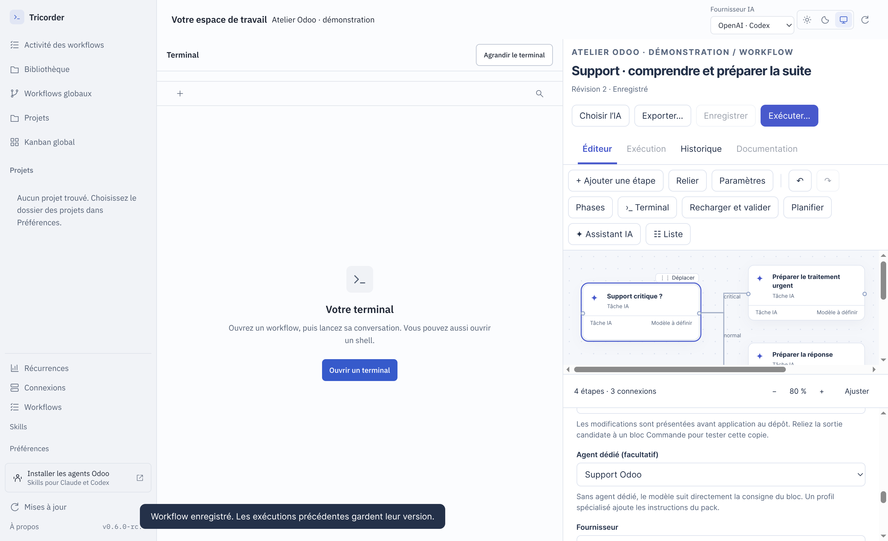

# Odoo Crew — revue des agents et des workflows, 8 octobre 2026

Cette release publie le pack Tricorder **0.3.1**, sa méthode de travail et une
revue des parcours release, express et support. Les profils CLI Claude/Codex
continuent à être générés depuis les mêmes sources canoniques.



Capture de Tricorder sur un projet fictif : contrat de bloc, ports et profil.
Elle atteste l’intégration d’interface, pas un diagnostic Odoo réel.

## Analyse du fonctionnement

La force du dispositif est la séparation du cadrage, de la réalisation et de la
réception, avec mémoire de projet et preuve liée au candidat. Le principal porte
le résultat ; les rôles apportent leur méthode. Un risque d’ergonomie demeure :
l’utilisateur doit connaître de nombreuses commandes et les différences entre
intention, tâche, flow, release et livraison. Tricorder doit les rendre visibles
sans créer une deuxième orchestration concurrente.

Référence avant publication : `c00c315`. Revue du routage, des profils, de
`workflows/odoo-workflow.json`, du manifeste Tricorder, des tests de pilotage et
d’outillage, du laboratoire et de la CI. La qualification métier historique du
laboratoire reste bornée aux séries et cas de ses rapports. Aucun gain de modèle
n’est extrapolé de la présente revue structurelle.

## Revue des parcours

| Parcours | Points à préserver | Écart ou amélioration à poursuivre |
|---|---|---|
| Release CLI | Intentions et critères, dépendances, mémoire fraîche, reprise QA bornée, clôture sans contrôle rouge | Vue consolidée besoin → décision → tâche → preuve → candidat livré, sans obliger à lire tous les fichiers. |
| Express CLI | Périmètre précis/réversible, réalisation par le principal, lint/update/test ciblé ; élargissement vers cadrage | Qualification courte explicitant pourquoi éligible ; aucune urgence ne doit effacer le risque sur droits, données ou montants. |
| Support CLI | Reproduction, cause, impact, contournement ; test rouge pour bug, passation sensible renforcée | Présenter séparément nature du problème, criticité et risque ; « inconnu » n’est pas « résolu ». |
| Livraison | Candidat testé, accord exact, suivi GitHub/Odoo.sh, vérification de la cible | Distinguer prêt, publié, build vert, déployé, reçu métier. Reprise après réponse perdue par lecture distante avant répétition. |
| Studio | Online compatible, pack versionné, tests sur copie | Améliorer la sélection par demande dans les projets mixtes ; un manifeste absent ne suffit pas à choisir toute la stratégie. |
| Pack Tricorder | Six profils spécialisés, I/O et branches détenus par le moteur | Ne pas importer les commandes CLI d’orchestration dans un bloc ; conserver les invariants métier sans les doubles flows. |
| Support graphique | Criticité puis traitement/précision, profils remplaçables | Tricorder corrige le nouvel aiguillage après précision ; la nature usage/données/bug reste à modéliser selon le besoin. |
| Release graphique | Intention → plan reçu → travail → contrôle → proposition | Pas d’équivalence avec la boucle CLI : QA rouge termine avec suite bloquée, puis tâche de correction explicite. |
| Meeting / communication | Fidélité aux décisions et actions, préparation du brouillon | Workflow générique ; ne pas le confier au pack Odoo par défaut. Destinations et envois sont des opérations séparées. |

## Changements du pack

Le contrat partagé `roles/tricorder.md` précise les limites entre mission et
orchestration : ports, critères et branches restent les mêmes si le fournisseur
ou le profil change. Les questions passent par le moteur et les réponses déjà
reçues ne sont pas redemandées sans changement de contexte.

La version 0.3.1 précise deux points issus de la revue : terminer une branche
non résolue n’autorise pas à annoncer le succès ; le projet cible, sa série et sa
plateforme se relisent pour chaque tâche transversale. Un bloc incompatible doit
être adapté explicitement, sans substitution silencieuse de profil ou modèle.

Tricorder contrôle ces invariants à sa frontière d’exécution : dépendances non
libérées après un résultat non résolu, paramètres effectifs, cible Online et
réaiguillage support. Le texte du profil accompagne ces contrôles ; il ne les
remplace pas. Les workflows CLI historiques ne sont pas modifiés par cette release.

## Axes d’amélioration priorisés

| Priorité | Hypothèse | Cas et critère à éprouver |
|---|---|---|
| P1 | Un résultat structuré commun faciliterait les passations | Constats, inconnues, preuves, risques et prochaine action sans champ inventé ; refus des résultats incomplets et contre-exemple hors bug. |
| P1 | Le contexte devrait être résolu par tâche | Deux projets de séries/plateformes différentes ; aucun développement Python Online ni preuve QA attribuée au mauvais candidat. |
| P1 | Mieux distinguer correction et livraison réduit les faux succès | QA rouge, push réussi/build rouge, résultat distant perdu ; verdict final fidèle aux observations. |
| P1 | La réception devrait afficher ce qui a été réellement vérifié | Test sauté, preuve périmée, résultat simulé et vrai témoin ; aucun passage vert par simple code de sortie. |
| P1 | Le choix standard/Studio/module appartient au cadrage | Demandes différentes sur le même dépôt mixte ; pas de développeur imposé par la présence d’un module. |
| P1 | Une reprise guidée réduit la répétition de questions et de contrôles | Réponse persistante, changement tardif d’intention, candidat modifié ; conserver les résultats indépendants et invalider les dépendants concernés. |
| P2 | Les consignes pourraient être encore plus ciblées | Comparer profils actuels et fragments à la demande, même fournisseur/modèle/effort ; mesurer omissions, pas seulement longueur. |
| P2 | L’indépendance d’une review doit avoir une utilité mesurée | Même dossier, cas sensible et contre-exemple banal ; conserver coût, qualité et désaccords, sans délégation systématique. |
| P2 | Support : impact, urgence et risque méritent des champs séparés | Incident urgent sans bug, bug sensible peu urgent, impact inconnu ; aucune conversion automatique urgence → express/production. |
| P2 | L’utilisateur devrait pouvoir suivre sans connaître le harness | Retrouver décision, blocage, preuve et prochaine action depuis Tricorder ; essai utilisateur sans assistance. |

Les axes restent expérimentaux jusqu’à reproduction, correction et contre-épreuve.
Aucun changement automatique des modèles, aucune campagne payante ni comparaison
native nouvelle n’a été lancé pour cette publication. Le routage déterministe
peut être identique entre fournisseurs sans que leur diagnostic soit aussi bon.

## Validation et adoption

Voir [validation.json](validation.json) pour les résultats. Commandes de référence :

```bash
python3 scripts/odoo_flow.py validate
python3 -m unittest discover -s tests -v
./build.sh --output-root /tmp/odoo-crew-release-check
./build.sh --output-root /tmp/odoo-crew-release-check --check
./build.sh
```

Adoptés : clarification du contrat importé, manifeste versionné, documentation et
contrôles d’intégration correspondants dans Tricorder. Non mesurés : effet des
nouvelles phrases sur le comportement d’un agent natif, qualité sur une nouvelle
série Odoo et gain de temps d’une release réelle.

Installation : récupérer cette release puis `./build.sh` pour les profils CLI.
Tricorder importe le pack par empreinte ; une ancienne exécution conserve son
contrat et ses profils figés. Les modèles déjà personnalisés ne sont pas écrasés.

[Release Tricorder associée](https://github.com/le-goff-benoit/odoo-tricorder/releases/tag/v0.6.0-rc.4)
